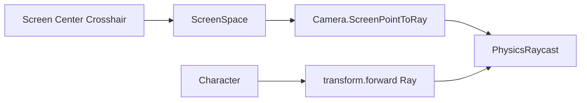

## 주제 선택 이유

처음에는 크로스헤어 위치가 잘못된 줄 알았다.
UI는 화면 중앙에 고정되어 있었지만 실제 피격 위치는 빗나갔다.
Ray 방향을 디버깅하면서 카메라 기준과 캐릭터 기준이 서로 다르다는 것을 확인했다.

FPS 조준 시스템 구현 중 다음과 같은 문제가 발생했다.

- 화면 중앙 크로스헤어는 정확해 보이는데 실제 피격 위치가 다름
- UI는 정상처럼 보이나, 게임 로직 결과가 예상과 다름
- 카메라 기준 Ray와 캐릭터 기준 Ray를 혼용
- 화면 좌표 기반 Raycast와 월드 좌표 기반 Raycast가 일관되지 않음

겉으로는 UI 문제처럼 보였지만,
실제로는 **Ray 생성 기준과 카메라/캐릭터 좌표계 혼합 문제**였다.

이 글에서는 해당 현상을
**Unity 공식 문서에 명시된 동작 규칙(팩트)** 기준으로 정리한다.

---

## 한눈에 보는 문제 구조 요약 (공식 문서 기준)

|요소|공식 문서 기준 동작|
|---|---|
|`Camera.ScreenPointToRay`|화면 좌표를 기준으로 Ray 생성|
|`Physics.Raycast`|Ray 방향을 기준으로 충돌 판정|
|`transform.forward`|오브젝트의 로컬 전방 방향|
|UI Canvas (Screen Space)|화면 좌표 기준으로 렌더링|

---

## (A) 공식 문서 기준 팩트

_(영문 Unity 공식 문서 기준)_

---

### 1. `Camera.ScreenPointToRay`는 화면 좌표를 기준으로 Ray를 생성한다

`Camera.ScreenPointToRay(Vector3 position)`는
**화면 공간(Screen Space) 좌표를 기준으로 Ray를 생성**한다.

이 Ray는 카메라의 위치와 방향을 기준으로 월드 공간 방향으로 변환된다.

출처:
[https://docs.unity3d.com/ScriptReference/Camera.ScreenPointToRay.html](https://docs.unity3d.com/ScriptReference/Camera.ScreenPointToRay.html)

---

### 2. `Physics.Raycast`는 Ray의 origin과 direction을 기준으로 충돌을 판정한다

`Physics.Raycast`는
전달된 Ray의 **origin(시작점)**과
**direction(방향)**을 기준으로 충돌을 판정한다.

충돌 판정은 UI 위치와는 무관하다.

출처:
[https://docs.unity3d.com/ScriptReference/Physics.Raycast.html](https://docs.unity3d.com/ScriptReference/Physics.Raycast.html)

---

### 3. `Transform.forward`는 오브젝트의 로컬 전방 방향이다

`transform.forward`는
해당 오브젝트의 **로컬 Z축 방향을 월드 공간 기준으로 변환한 방향 벡터**이다.

이는 카메라의 forward와 동일하지 않을 수 있다.

출처:
[https://docs.unity3d.com/ScriptReference/Transform-forward.html](https://docs.unity3d.com/ScriptReference/Transform-forward.html)

---

### 4. Screen Space Canvas는 화면 기준으로 렌더링된다

Screen Space – Overlay 또는 Screen Space – Camera Canvas는
**화면 좌표 기준으로 UI를 렌더링**한다.

UI 위치는 월드 좌표 충돌 판정과 직접적인 연관이 없다.

출처:
[https://docs.unity3d.com/Manual/UICanvas.html](https://docs.unity3d.com/Manual/UICanvas.html)

---

### 5. Camera의 위치와 Transform.forward는 서로 다른 기준을 가질 수 있다

카메라는 하나의 Transform을 가지며,
그 위치와 방향은 다른 오브젝트(예: 플레이어 캐릭터)와 다를 수 있다.

출처:
[https://docs.unity3d.com/Manual/class-Camera.html](https://docs.unity3d.com/Manual/class-Camera.html)

---

## (B) 업계 관행

※ 공식 문서에 명시된 규칙은 아니다

- FPS 조준 시스템에서는:
    - **카메라 기준 Raycast를 사용하는 경우가 많다**

- 크로스헤어는:
    - 화면 중앙(Screen Center) 고정

- 무기 발사 위치와 카메라 위치가 다를 경우:
    - 1차 카메라 Raycast로 타겟 위치 결정
    - 2차 무기 위치에서 해당 지점으로 보정 Raycast 수행

---

## (C) 나의 해석

이번 문제의 핵심은
**“조준 기준”이 통일되지 않았다는 점**이었다.

- UI 크로스헤어는 화면 중앙
- Raycast는 `transform.forward` 기준
- 카메라는 캐릭터와 약간 다른 위치

이 상태에서:

- 화면 중앙은 카메라 기준
- 실제 발사 Ray는 캐릭터 기준

으로 분리되면서
**보이는 조준점과 실제 피격 위치가 달라졌다.**

또한 UI는 Screen Space 기준이므로
게임 월드에서 발생하는 Raycast 결과와
직접적인 일치 관계를 보장하지 않는다.

이번 경험을 통해 확인한 점은:

> UI가 정상적으로 보인다고 해서
> 게임 로직이 동일한 기준을 사용하고 있다는 의미는 아니다.

조준 시스템에서는
**카메라 기준 / 캐릭터 기준 / 무기 기준 중 하나로
명확히 통일된 Ray 생성 전략이 필요하다.**

---

---

## 한 줄 정리

**조준 시스템에서 화면 기준, 카메라 기준, 캐릭터 기준을 혼용하면
UI와 실제 피격 판정이 일치하지 않는다.**