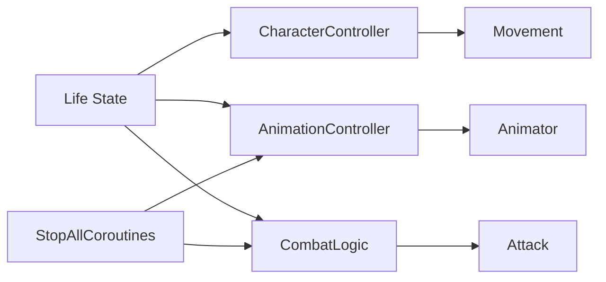

## 주제 선택 이유

캐릭터 사망, 일시정지(Pause), 상점 진입(Shop) 등
**캐릭터의 생명주기 상태가 전환되는 시점**에서 다음과 같은 문제가 발생했다.

- `CharacterController`와 `AnimationController`가 서로 강하게 의존
- `StopAllCoroutines()` 호출 이후 의도치 않은 로직 중단
- 컴포넌트 비활성화 시점에 따라 이동·공격이 계속 동작
- `IsDead` 상태임에도 캐릭터가 입력에 반응

겉으로 보면 개별 구현 실수처럼 보였지만,
실제로는 **컴포넌트 책임 분리와 생명주기 관리 구조 문제**로 귀결되었다.

이 글에서는 해당 현상을
**Unity 공식 문서에 명시된 동작 규칙(팩트)** 기준으로 정리한다.

---

## 한눈에 보는 생명주기 문제 요약 (공식 문서 기준)

|요소|공식 문서 기준 동작|
|---|---|
|Component 활성화|비활성화 시 `Update()` 등 이벤트 미호출|
|Coroutine|`StopAllCoroutines()` 호출 시 해당 MonoBehaviour의 모든 코루틴 중단|
|`enabled = false`|해당 컴포넌트의 이벤트 함수 호출 중단|
|`GameObject.SetActive(false)`|모든 컴포넌트와 자식 비활성화|
|Update()|매 프레임 호출|

---

## (A) 공식 문서 기준 팩트

_(영문 Unity 공식 문서 기준)_

### 1. `MonoBehaviour` 간 의존성은 자동으로 관리되지 않는다

Unity에서 각 `MonoBehaviour`는
**독립적인 컴포넌트**로 동작한다.

한 컴포넌트의 상태 변경이
다른 컴포넌트의 동작을 자동으로 제어하지 않는다.

출처:  
[https://docs.unity3d.com/Manual/Components.html](https://docs.unity3d.com/Manual/Components.html)

---

### 2. `StopAllCoroutines()`는 해당 MonoBehaviour의 모든 코루틴을 중단한다

`StopAllCoroutines()`를 호출하면,
**해당 MonoBehaviour에서 실행 중인 모든 코루틴이 즉시 중단**된다.

개별 코루틴을 선택적으로 중단하지 않는다.

출처:
[https://docs.unity3d.com/ScriptReference/MonoBehaviour.StopAllCoroutines.html](https://docs.unity3d.com/ScriptReference/MonoBehaviour.StopAllCoroutines.html)

---

### 3. 컴포넌트를 비활성화하면 해당 컴포넌트의 이벤트 함수는 호출되지 않는다

`MonoBehaviour.enabled = false`로 설정하면,
`Update()`, `FixedUpdate()`, `LateUpdate()` 등
**해당 컴포넌트의 이벤트 함수는 호출되지 않는다**.

출처:
[https://docs.unity3d.com/ScriptReference/Behaviour-enabled.html](https://docs.unity3d.com/ScriptReference/Behaviour-enabled.html)

---

### 4. GameObject를 비활성화하면 모든 컴포넌트가 함께 비활성화된다

`GameObject.SetActive(false)`를 호출하면,
해당 GameObject와 그 자식 오브젝트에 포함된
**모든 컴포넌트가 비활성화**된다.

출처:
[https://docs.unity3d.com/ScriptReference/GameObject.SetActive.html](https://docs.unity3d.com/ScriptReference/GameObject.SetActive.html)

---

### 5. Update()는 매 프레임 호출되며, 조건 분기가 없으면 계속 실행된다

`Update()`는
컴포넌트가 활성화되어 있는 동안 **매 프레임 호출**된다.

상태 검사(`IsDead` 등)가 없다면,
사망 상태에서도 로직이 계속 실행될 수 있다.

출처:
[https://docs.unity3d.com/Manual/ExecutionOrder.html](https://docs.unity3d.com/Manual/ExecutionOrder.html)

---

## (B) 업계 관행

※ 공식 문서에 명시된 규칙은 아니다

- `CharacterController`
    - 이동, 회전, 입력 처리 담당

- `AnimationController`
    - 애니메이션 파라미터 및 전이만 담당

- 생명주기 상태(Alive / Dead / Pause / Shop)는
    - **중앙 상태(State) 또는 플래그**로 관리하는 경우가 많다

- `StopAllCoroutines()`는
    - 긴급 정지 상황에서만 사용
    - 일반 상태 전환에는 개별 코루틴 제어를 선호

---

## (C) 나의 해석

이번 문제의 핵심은
**“죽었다”는 상태를 단일 플래그로 모든 시스템에 동시에 적용하려 한 구조**였다.

- `IsDead` 하나로:
    - 이동 차단
    - 공격 차단
    - 애니메이션 제어
    - 코루틴 중단
        을 모두 처리하면서,
        컴포넌트 간 책임 경계가 무너졌다.

특히 `StopAllCoroutines()`를 호출하면서:

- 공격 쿨타임
- 피격 무적 처리
- 애니메이션 타이밍 보조 로직
    까지 함께 중단되어
    **의도하지 않은 후속 문제**가 발생했다.

또한 컴포넌트 비활성화 타이밍이 일관되지 않아:

- 입력 컴포넌트는 살아 있고
- 이동 컴포넌트는 비활성화
- 애니메이션만 재생되는
    **어중간한 상태**가 만들어졌다.

이번 경험을 통해,
캐릭터의 생명주기는 **“로직을 끊는 시점”의 문제가 아니라
“어떤 컴포넌트를 언제 책임에서 제외할 것인가”의 문제**라는 점을 인식하게 되었다.

---

## 구조 요약 다이어그램

---

## 한 줄 정리

**캐릭터 생명주기를 단일 플래그로 제어하면
컴포넌트 간 책임이 붕괴되고 예측 불가능한 동작이 발생한다.**