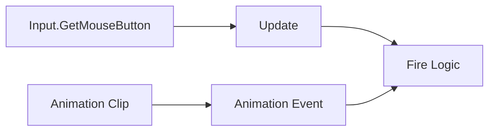

## 주제 선택 이유

협업 프로젝트에서
마우스 클릭 한 번에 **총이 두 번 발사되는 문제**가 발생했다.

처음에는 단순한 입력 처리 실수처럼 보였지만,
원인을 추적하는 과정에서 다음 요소들이 동시에 얽혀 있음을 확인했다.

- `Input.GetMouseButton` 기반 입력 처리

- `Update()`에서의 전투 로직 호출

- `Animation Event`를 통한 발사 트리거

- 애니메이션 타이밍에 로직을 의존한 설계

이 글에서는 해당 현상을
**공식 문서에 명시된 동작 규칙(팩트)** 기준으로 정리하고,
그 위에서 설계적으로 어떤 문제가 있었는지 정리한다.

---

## 한눈에 보는 중복 호출 구조 요약 (공식 문서 기준)

|요소|공식 문서 기준 동작|
|---|---|
|`Input.GetMouseButton`|버튼을 누르고 있는 동안 매 프레임 `true`|
|`Update()`|매 프레임 호출|
|Animation Event|애니메이션 타임라인 도달 시마다 호출|
|애니메이션 Loop|반복 재생 시 Event도 반복 호출|

---

## (A) 공식 문서 기준 팩트

_(영문 Unity 공식 문서 기준)_

### 1. `Input.GetMouseButton`는 버튼이 눌려 있는 동안 매 프레임 `true`를 반환한다

`Input.GetMouseButton(int button)`은
지정한 마우스 버튼이 눌려 있는 동안 **매 프레임 `true`를 반환**한다.

출처:
[https://docs.unity3d.com/ScriptReference/Input.GetMouseButton.html](https://docs.unity3d.com/ScriptReference/Input.GetMouseButton.html)

---

### 2. `Update()`는 매 프레임 한 번 호출된다

`Update()` 함수는 **프레임마다 한 번 호출**된다.
입력 처리는 일반적으로 `Update()`에서 수행된다.

출처:
[https://docs.unity3d.com/Manual/ExecutionOrder.html](https://docs.unity3d.com/Manual/ExecutionOrder.html)

---

### 3. `Update()`에서 `Input.GetMouseButton`을 조건으로 사용할 경우 조건은 매 프레임 유지된다

공식 문서의 동작 규칙에 따르면,
`Update()` 내부에서 `Input.GetMouseButton`을 조건으로 사용할 경우
버튼을 누르고 있는 동안 **해당 조건은 매 프레임 참**이 된다.

출처:
[https://docs.unity3d.com/ScriptReference/Input.GetMouseButton.html](https://docs.unity3d.com/ScriptReference/Input.GetMouseButton.html)  
[https://docs.unity3d.com/Manual/ExecutionOrder.html](https://docs.unity3d.com/Manual/ExecutionOrder.html)

---

### 4. Animation Event는 애니메이션 타임라인 기준으로 호출된다

Animation Event는
애니메이션 클립의 **특정 시간(프레임)에 도달했을 때 함수 호출을 발생**시킨다.

이 호출은 애니메이션 타임라인을 기준으로 하며,
입력 상태나 스크립트 로직의 흐름을 자동으로 고려하지 않는다.

출처:
[https://docs.unity3d.com/Manual/AnimationEventsOnImportedClips.html](https://docs.unity3d.com/Manual/AnimationEventsOnImportedClips.html)

---

### 5. 애니메이션이 반복 재생되면 Animation Event도 반복 호출된다

Animation Event가 포함된 애니메이션 클립이
**Loop 설정으로 반복 재생될 경우**,
해당 Event 역시 **매 반복마다 호출**된다.

출처:
[https://docs.unity3d.com/Manual/AnimationEventsOnImportedClips.html](https://docs.unity3d.com/Manual/AnimationEventsOnImportedClips.html)

---

### 6. Animation Event는 애니메이션 클립에 정의된 이벤트이다

Animation Event는
스크립트가 아니라 **애니메이션 클립 자체에 정의된 이벤트**이다.
애니메이션 시스템에 의해 호출된다.

출처:
[https://docs.unity3d.com/Manual/AnimationEventsOnImportedClips.html](https://docs.unity3d.com/Manual/AnimationEventsOnImportedClips.html)

---

### 7. Input 시스템과 Animation 시스템은 서로 독립적인 Unity 시스템이다

Input 처리와 Animation 재생은
Unity에서 **서로 다른 시스템**으로 관리된다.
한 시스템의 호출이 다른 시스템을 자동으로 제어하지 않는다.

출처:
[https://docs.unity3d.com/Manual/Input.html](https://docs.unity3d.com/Manual/Input.html)  
[https://docs.unity3d.com/Manual/AnimationOverview.html](https://docs.unity3d.com/Manual/AnimationOverview.html)

---

## (B) 업계 관행

※ 공식 문서에 명시된 규칙은 아니다

- 입력(Input)은 **의도(Intent)만 판단**하는 역할로 제한한다.

- 실제 전투 로직(발사, 데미지)은 **상태 기반(State / Cooldown)**으로 제어한다.

- Animation Event는:
    - 이펙트 재생
    - 사운드 타이밍
    - 보조 트리거
        용도로 사용하는 경우가 많다.

- 핵심 전투 로직을 Animation Event에 직접 맡기는 설계는 피하는 경우가 많다.

---

## (C) 나의 해석

총이 두 번 발사된 이유는
**단일 원인 버그가 아니라, 구조적인 중복 호출 조건이 동시에 만족되었기 때문**이다.

- `Update()`는 매 프레임 호출되고
- `Input.GetMouseButton`은 누르는 동안 매 프레임 `true`
- Animation Event는 애니메이션 타임라인 도달 시마다 호출

이 상태에서:

- 스크립트에서도 발사 로직을 호출하고
- Animation Event에서도 발사 로직을 호출하면

**“한 번 쏜다”는 의도가
프레임 기준 + 애니메이션 기준으로 중복 처리될 수 있다.**

특히 애니메이션 타이밍에 로직을 맡길 경우,

- 애니메이션 Loop
- 상태 전환 타이밍
    에 따라 **의도하지 않은 다중 호출**이 발생할 가능성이 커진다.

---

## 구조 요약 다이어그램

---

## 한 줄 정리

**입력, 애니메이션, 전투 로직을 같은 책임으로 다루면
의도하지 않은 중복 호출이 발생한다.
각 시스템의 역할을 분리해야 한다.**