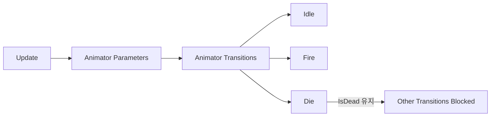

## 주제 선택 이유

전투 및 사망 처리 과정에서 다음과 같은 문제가 연속적으로 발생했다.

- 공격 애니메이션이 **Idle 상태로 튕김**

- 죽음 애니메이션이 **중간에 끊김**

- `IsDead` 플래그 하나로 입력, 전투, 애니메이션 시스템 전체가 영향을 받음

- `Update()`에서의 `return` 위치에 따라 애니메이션이 재생되지 않음

겉으로 보면 각각 다른 버그처럼 보였지만,
원인을 추적해보니 **Animator 파라미터 설계와 전이 구조 문제**로 수렴했다.

이 글에서는 해당 현상을
**Unity Animator의 공식 동작 규칙(팩트)** 기준으로 정리한다.

---

## 한눈에 보는 문제 구조 요약 (공식 문서 기준)

|항목|공식 문서 기준 동작|
|---|---|
|Bool Parameter|조건이 유지되는 동안 계속 참|
|Trigger Parameter|조건 충족 시 1회 소비 후 자동 해제|
|Animator Transition|조건이 만족되면 언제든 전이 가능|
|Any State|현재 상태와 무관하게 전이 가능|
|Update()|매 프레임 호출|

---

## (A) 공식 문서 기준 팩트

_(영문 Unity 공식 문서 기준)_

### 1. Animator Parameter 중 Bool은 상태 유지형 파라미터이다

Unity 공식 문서에 따르면,
Bool 파라미터는 `true / false` 값을 **명시적으로 변경하기 전까지 유지**된다.

즉, 한 번 `true`가 되면
다시 `false`로 설정되지 않는 한 조건이 계속 유지된다.

출처:
https://docs.unity3d.com/Manual/AnimatorParameters.html

---

### 2. Trigger 파라미터는 조건 충족 시 1회 소비된다

Trigger 파라미터는
조건이 충족되어 전이가 발생하면 **자동으로 리셋**된다.

Trigger는 **일회성 이벤트 표현**을 위해 제공되는 파라미터이다.

출처:
https://docs.unity3d.com/Manual/AnimatorParameters.html

---

### 3. Animator Transition은 조건이 만족되면 즉시 전이될 수 있다

Unity 공식 문서에 따르면,
Animator 상태 전이는 **조건이 만족되는 즉시 전이될 수 있다**.

현재 상태의 애니메이션이 끝났는지 여부와는 별개로,
전이 조건이 우선 적용될 수 있다.

출처:
[https://docs.unity3d.com/Manual/class-Transition.html](https://docs.unity3d.com/Manual/class-Transition.html)

---

### 4. Any State 전이는 현재 상태와 무관하게 발동된다

Any State에서 설정한 전이는
현재 재생 중인 상태와 관계없이 조건이 만족되면 전이된다.

이 전이는 **전역 전이**로 동작한다.

출처:
[https://docs.unity3d.com/Manual/class-State.html](https://docs.unity3d.com/Manual/class-State.html)

---

### 5. Animator는 매 프레임 파라미터를 평가한다

Animator는 매 프레임 파라미터 값을 평가하여
전이 조건이 충족되는지를 판단한다.

이 평가는 `Update()` 루프와 함께 반복된다.

출처:
[https://docs.unity3d.com/Manual/ExecutionOrder.html](https://docs.unity3d.com/Manual/ExecutionOrder.html)  
[https://docs.unity3d.com/Manual/AnimatorControllers.html](https://docs.unity3d.com/Manual/AnimatorControllers.html)

---

### 6. Update()는 매 프레임 호출되며, return 이후 코드는 실행되지 않는다

`Update()`는 매 프레임 호출되지만,
함수 내부에서 `return`을 만나면 **그 이후 코드는 실행되지 않는다**.

출처:
[https://docs.unity3d.com/Manual/ExecutionOrder.html](https://docs.unity3d.com/Manual/ExecutionOrder.html)

---

## (B) 업계 관행

※ 공식 문서에 명시된 규칙은 아니다

- **Bool 파라미터**
    - 지속 상태(Idle, Run, IsDead 등)에 사용

- **Trigger 파라미터**
    - 공격, 피격, 사망 등 **단발성 이벤트**에 사용

- 사망 애니메이션은:
    - Any State → Die
    - 조건 최소화
        구조로 설계하는 경우가 많다.

- 핵심 애니메이션 전이를:
    
    - `Update()`의 조건 분기
    - 다중 Bool 조합
        에 과도하게 의존하지 않는 경우가 많다.

---

## (C) 나의 해석

이번 문제의 핵심은
**Animator 파라미터가 “상태”와 “이벤트”를 구분하지 못한 구조**였다.

- `IsFire`를 Bool로 유지하면서

- `Idle`, `Fire`, `Die` 전이가 동시에 평가되자

- 조건 충돌로 인해 **Idle 상태로 튕기는 전이**가 발생했다.

또한 `IsDead` 하나의 Bool 플래그로:

- 입력 차단

- 전투 로직 중단

- Animator 전이 제어

를 모두 처리하면서,
사망 애니메이션이 끝나기도 전에
`Update()`에서 `return`되어 **Animator 파라미터가 더 이상 갱신되지 않는 구조**가 되었다.

그 결과:

- 사망 애니메이션이 중간에 끊기거나

- Any State 전이가 정상적으로 유지되지 않는 문제가 발생했다.

이번 경험을 통해
**Animator 파라미터 설계는 단순 변수 선택 문제가 아니라,
시스템 책임 분리 문제**라는 점을 다시 인식하게 되었다.

---

## 구조 요약 다이어그램

---

## 한 줄 정리

**Animator 파라미터를 상태와 이벤트로 구분하지 않으면
전이 충돌로 인해 애니메이션과 시스템 전체가 흔들린다.**